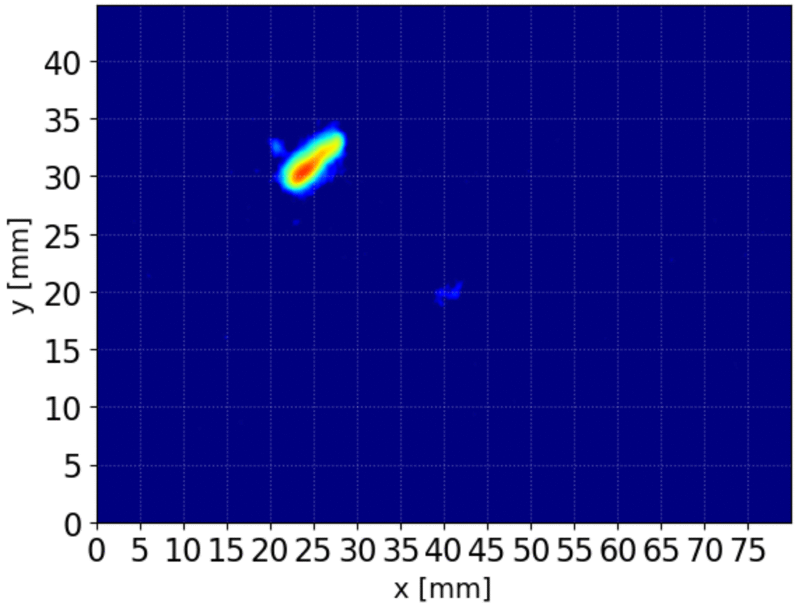

# migYOLO v1.0.0

**Update (June 24th, 2024): Data is available (see Installation instructions in the [official documentation](https://migyolo.readthedocs.io/en/latest/))**

migYOLO is a package containing tools for using the YOLOv8-based processing and rare event search analysis pipeline for CMOS camera data from the MIGDAL experiment ([paper preprint here](https://arxiv.org/abs/2406.07538)). This package has GPU support through PyTorch. For installation and usage instructions, please consult the [official documentation](https://migyolo.readthedocs.io/en/latest/).

