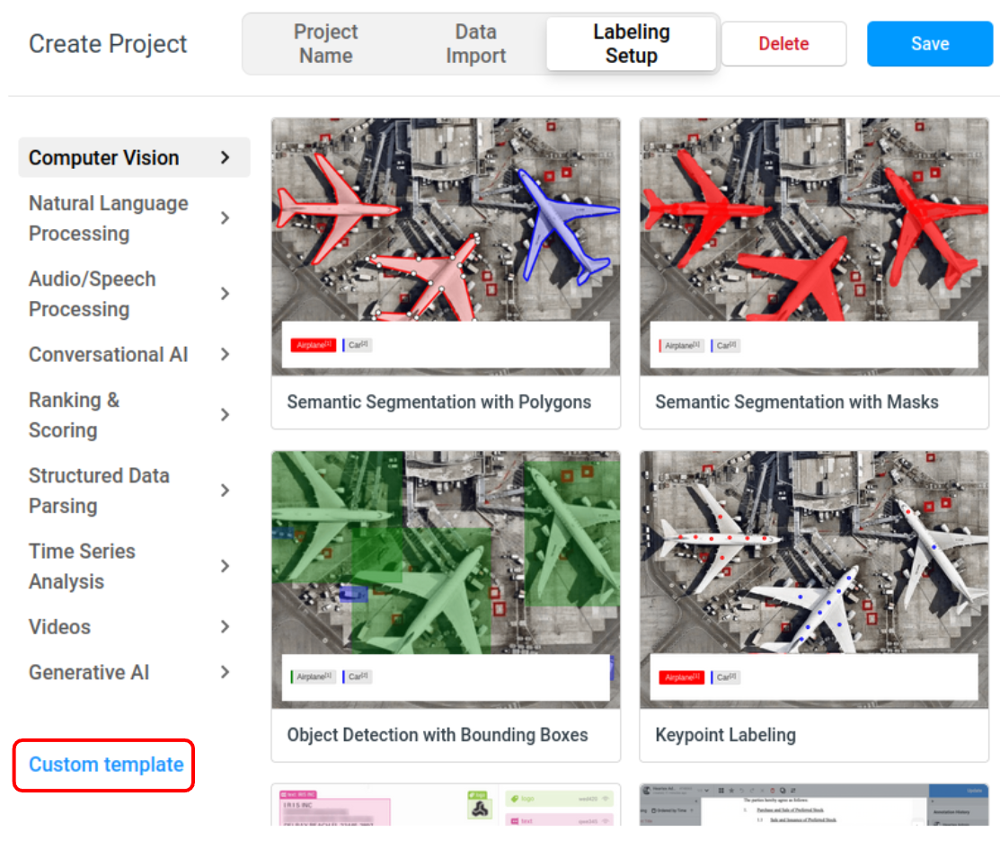
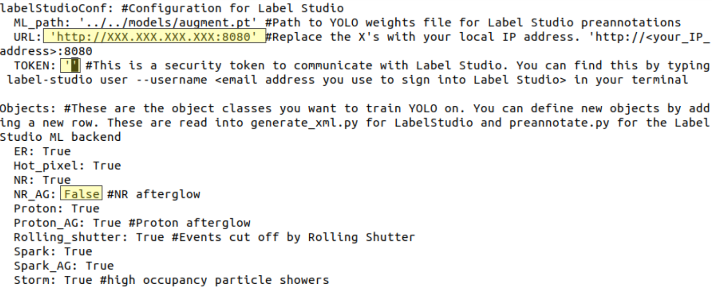
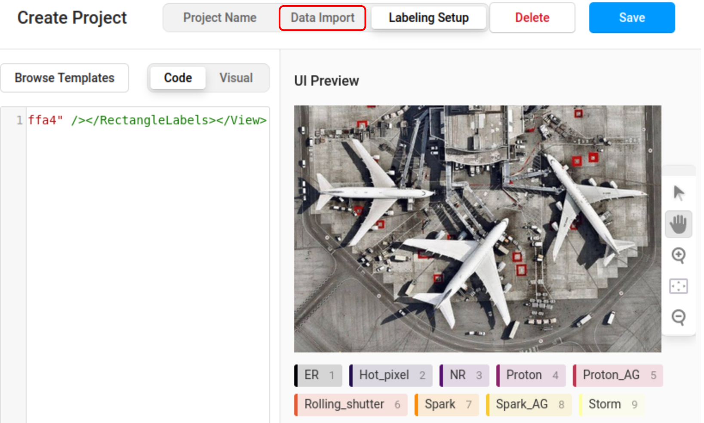
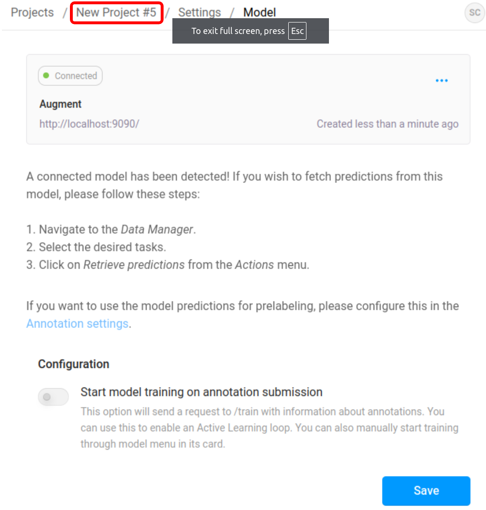
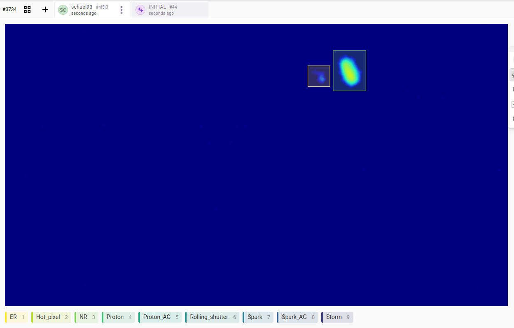

# Setting up automated preannotations

migYOLO interfaces with the open-source [Label Studio labeling software](https://labelstud.io/). This tutorial runs through how to import a pre-trained YOLO model to generate automated pre-annotations of tracks as is demonstrated in Section III B and Figure 5 of [our paper](https://arxiv.org/abs/2406.07538). **Note: This Section isn't needed for evaluating our pretrained YOLO models, so feel free to skip it if you aren't interested in efficiently labeling real data for training. If you are interested in generating pre-annotations from a trained YOLOv8 model, then please follow the instructions below. While these instructions use MIGDAL data, this procedure is general and should work with any YOLOv8 object detection task.**

## Instructions

1. In a terminal window type `label-studio`. A browser window will pop up. Either sign up or log into your existing account if you have one.

2. Once you log in there should be a button that says `Create`. Click on this button to create a labeling project. A pop-up window will open where you can enter your Project Name and description. Click on the `Labeling Setup` tab and then click `Custom template`.



3. A code block will show up. Delete the code block, and follow the procedure below to use migYOLO to generate custom XML code for this labeling project:

3a. Navigate to `migYOLO/migYOLO/LabelStudio/Example` and open `labelStudio_configuration.yaml`.



3b. For this example make sure all fields under the `Objects` header are set to True *except* for `NR_AG`. Set `NR_AG` to False

3c. Replace the highlighted URL with your machine's local IP address

3d. Fill in the highlighted TOKEN field with your Label Studio API token. You can find this by typing the following in your terminal:

```sh
label-studio user --username <Label Studio login email address>
```

Make sure to remove the "<" and ">" brackets when you type in your email address. The output of this command is a python dictionary; copy and paste the value of the `'token'` field from the output dictionary into the `TOKEN` field of `labelStudio_configuration.yaml`

3e. Navigate to `migYOLO/migYOLO/LabelStudio/Example/` and run

```sh
python3 make_labeling_template.py
```

3f. An xml file called `output.xml` will be generated. Open the xml file, copy its contents, and paste it into the Label Studio code block. Nine label icons should now pop up as shown below




3g. Click on `Data Import` (boxed in red in the image above). You can load the `migYOLO/migYOLO/LabelStudio/Example/sample_pngs` directory by opening it up in a file browser and dragging the `sample_pngs` folder icon into the label Studio interface. Once the files have uploaded, click save.

4. Next we need to create our machine learning (ML) backend. In the `migYOLO/migYOLO/LabelStudio/Example` directory, run `create_ml_environment.sh` with

```sh
source create_ml_environment.sh
```

The script will prompt you to enter a project name. Let's enter `proj` as the name for now.

5. Now we can start the ML backend with

```sh
source start_ml_backend.sh
```

This script will also prompt you to enter a project name. Enter the name of the project you would like to start the backend for. (Use the name you created in Step 4 if doing this for the first time)

6. Now, open up the label studio window and click `Settings` and then on the left hand side of the window click `Model` and then there will be a blue button that says `Connect Model`. Click on `Connect model`

7. A popup window will come up. Fill it out as shown (you can change the name) and click `Validate and Save`. The model should connect.




8. Go back to your project homepage by clicking your project name (boxed in red in the above image). Click on an image and the model should automatically annotate it!



## General usage

Now that you've set this up once, moving forward, if you want to use the same ML backend you simply need to run `source start_ml_backend.sh` enter the appropriate project name, and then load you model in the Label Studio front end at Settings->Model.

If you want to change your YOLO model, you can simply change the model path in `labelStudio_configuration.yaml`, then create a new project with `source create_ml_environment.sh`, start it with `source start_ml_backend.sh` and load in in the Label Studio front end at Settings->Model.