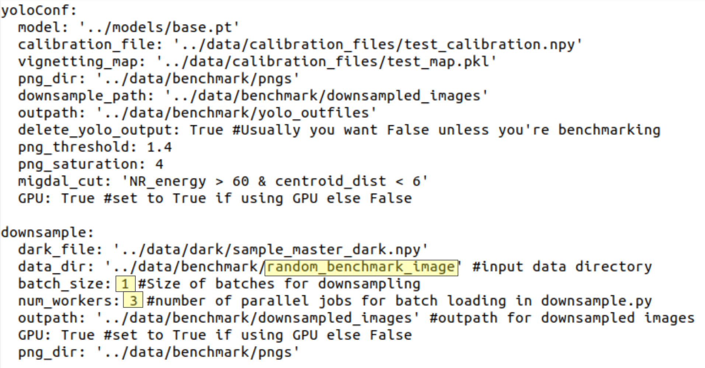
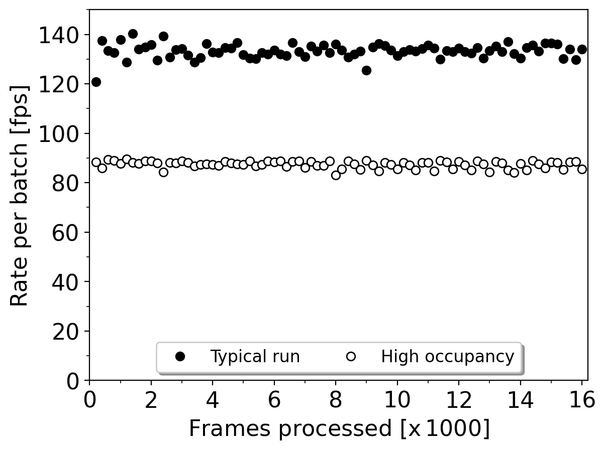

# Benchmarking processing speed

**Note: [GNU Screen](https://www.gnu.org/software/screen/) is required to run the benchmark script.**

The `migYOLO/migYOLO/benchmark/` directory has a sample benchmark script called `runBenchmark.sh` that can be used to generate the output shown in Fig. 7 of the [paper](https://arxiv.org/abs/2406.07538).

## Benchmarks

The highlighted fields of `benchmarkConf.yaml` shown below can be adjusted for various tests:

* `data_dir: ../data/benchmark/random_benchmark_image` corresponds to the "Typical run" entry in the legend of the figure below

* Setting `data_dir: ../data/benchmark/high_occupancy_image` corresponds to the "High occupancy run" entry in the legend of the figure below

* The defaults of `batch_size: 1` and `num_workers: 3` are the values used for benchmarking the processing speed on the MIGDAL readout PC

## Running the benchmark

Navigate to `migYOLO/migYOLO/benchmark` and run `source runBenchmark.sh`. The script will prompt you on how many images you would like to benchmark. After running the script, a directory called `timestamps/` will generate text files containing timestamps. The elapsed time between two successive timestamp files is the time it took to process 200 frames. These timestamp files are what were used to create the figure above.

**Two important notes**

**1. As stated above, GNU screen is required to run `runBenchmark.sh`.**

**2. Each time `runBenchmark.sh` is run, the `timestamps/` directory is deleted. The explicit code for generating the figure above is also not included here.**