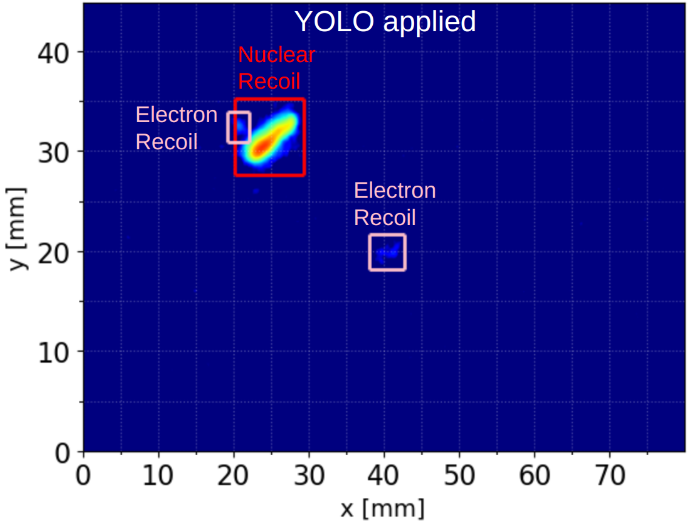

# Introduction

migYOLO is a collection of software tools meant to serve as a companion to the MIGDAL collaboration paper: [Transforming a rare event search into a not-so-rare event search in real-time with deep learning-based object detection](https://arxiv.org/abs/2406.07538). In the paper we highlight a [YOLOv8](https://github.com/ultralytics/ultralytics)-based pipeline designed for real time rare event search analyses on 2D high resolution images of particle tracks recorded by the [Hamamatsu ORCA-Quest qCMOS](https://camera.hamamatsu.com/content/dam/hamamatsu-photonics/sites/documents/99_SALES_LIBRARY/sys/SCAS0154E_C15550-20UP_tec.pdf) camera readout of the MIGDAL detector.

## What does this pipeline do

Chapter III of the paper goes into full detail of what the pipeline does. In short, the pipeline does the following:

1. Reads in batches of 200 images

2. Processes the images by (a) downsampling using 4x4 binning and (b) Gaussian filtering the downsampled images

3. Feeds the processed images into a pretrained model of YOLOv8 that identifies bounding boxes (example shown below)

4. Performs a physics analysis on each bounding box identified as either a nuclear recoil, electron recoil, or proton. The quantities extracted are the track's energy, length, axial angle, and for electron reocils and nuclear recoils only, vector angle (after applying rudimentary head/tail corrections).

5. Each bounding box's extracted physics quantities, bounding box coordinates, classification ID, and classification confidence score are added to a bounding box-indexed Pandas dataframe. The dataframe corresponding to the entire batch of 200 images is saved.

6. Each unique electron recoil -- nuclear recoil present in a given frame that satisfies user defined Migdal skim criteria is separately saved in a electronRecoil-nuclearRecoil pair-indexed file.

## What does this package include

1. Pretrained YOLO files `migYOLO/migYOLO/models/base.pt` and `migYOLO/migYOLO/models/augment.pt` that correspond to the Base and Augment training samples described in Table I and Table III of the paper, respectively.

2. [Label Studio integration](https://migyolo.readthedocs.io/en/latest/Automated%20Preannotations.html) for automated preannotations. These instructions guide you through the process of plugging a pretrained YOLOv8 model into the backend of label-studio to automatically generate bounding box labels on training images input into Label Studio. Some sample images of MIGDAL tracks are included in the `migYOLO/migYOLO/LabelStudio/Example/sample_pngs` directory are included for convenience. **Note: The Label Studio functionality can be applied for your own projects that are completely independent of the MIGDAL experiment. After following the procedure in this link it should be clear how to adjust it for your purposes.**

3. Scripts to run the pipeline on 1,000 preselected images

4. Jupyter notebook tutorials for (1) downsampling images and processing them with YOLO, and (2) visualizing the output of YOLO run on the 1,000 preselected images. These scripts show some simple analyses of YOLO's output.

5. Benchmark scripts in `migYOLO/migYOLO/benchmark/` to test the processing speed of the end-to-end pipeline (Fig. 7 in the paper)

## Using the package
Each entry in the table of contents to the left can be treated as a tutorial of a particular feature of migYOLO. Explore at your leisure and please ask any questions or report any issues you find on the [migYOLO git repo page](https://github.com/jschuel/migYOLO)