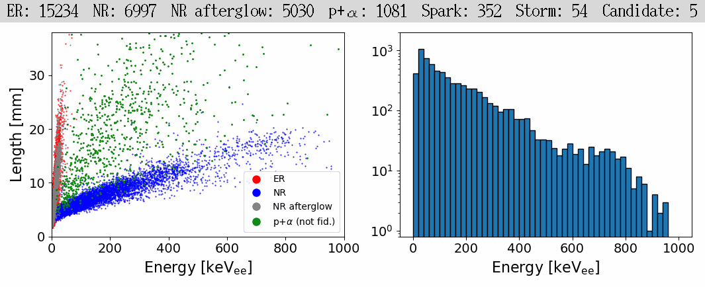

# Live Display

The pipeline also has support for live datastreams (Section V in [our paper](https://arxiv.org/abs/2406.07538)). The code for integrating this with the sample data included in this package is coming soon. The gif below shows a sped up version of a datastream recorded during a MIGDAL run.

